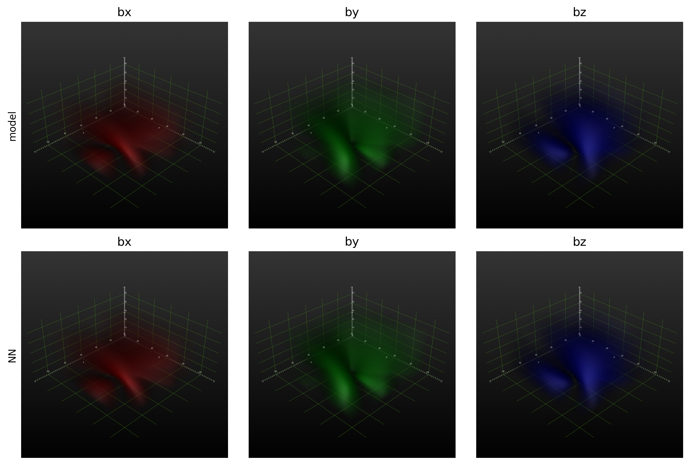

# PF2nlfff

Physics-Reinforced Generative Adversarial Network (PRO-GAN) for extrapolation

[](https://doi.org/10.5281/zenodo.18972720)

The design, test, and application of PRO-GAN can be found in [this paper](https://ui.adsabs.harvard.edu/abs/2026ApJ..1001...96C).

## Installation
Install the one with basic functions
```bash
git clone git@github.com:gychen-NJU/PF2nlfff.git
cd PF2nlfff
pip install .
```
To install the one with additional visualization module, please run
```bash
pip install .[visual]
```
Or install the version with full module
```bash
pip install .[all]
```


## Usage
### Load the samples
```python
import torch
from PF2nlfff.utils.data import samples
LL_data = samples().LL # load a Lou & Low magnetic field model for example
nx,ny,nz = LL_data.shape[1:] # get data size
boundary = LL_data[...,0].copy() # acquire bottom boundary
bound_tensor = torch.from_numpy(boundary).float() # convert to torch tensor
```
Extrapolation starts from the bottom boundary to reconstruct a 3D magnetic field.
Users can use their own magnetic field data, just replace the `LL_data` with their own data.
Ensuring the data size is (3,nx,ny) and convert it to `torch.Tensor` type.

### Extrapolation pipline
```python
from PF2nlfff import PROGAN
progan = PROGAN(bound_tensor,device='cuda:1')
res = progan(
    nz = nz,
    nn_config=dict(
        epoch=10000,
        print_epoch=500,
        Delta = 10,
        gamma = 0.994,
        L_div = 1.e-1,
        L_ff  = 1.e-2,
        L_lf  = 1.e-1,
        ), # set nn_config to activate the neural network training
    )
```
This pipline will perform potential extrapolation, rapid extrapolation, and if `nn_config` is provided,
physics-rinforced retraining with neural network will be executed.
If `nn_config` is not provided, only potential and rapid extrapolation will be performed.
Users can get the extrapolated magnetic field from `res.PF`, `res.fast` and `res.nn`.

User also can perform extrapolation along with
```python
from PF2nlfff import extrapolation
```
Then use `extrapolation.PF` to perform potential extrapolation, `extrapolation.nlfff` to perform NLFFF extrapolation.

### Visualization
When install with `pip install .[visual]` or `pip install .[all]`, users can renders the 3D field by:
```python
from PF2nlfff.utils.visual import BcubeRen
BcubeRen(bucbe, out_dir='./LL/')
```
This will generate a series of 3D field images in the `out_dir` directory.
Under the [examples](examples/) folder you can find a examples of 3d volume render.  


## Authors
Guoyin Chen -- [gychen@smail.nju.edu.cn](mailto:gychen@smail.nju.edu.cn)<br>
Yang Guo    -- [guoyang@nju.edu.cn](mailto:guoyang@nju.edu.cn)<br>
Qi Hao      -- [haoqi@nju.edu.cn](mailto:haoqi@nju.edu.cn)

## License
This project is licensed under the MIT License. Please refer to the [LICENSE](LICENSE) file for details.

